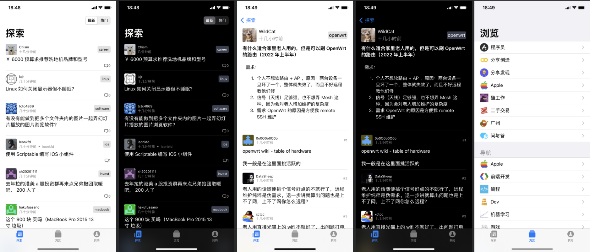
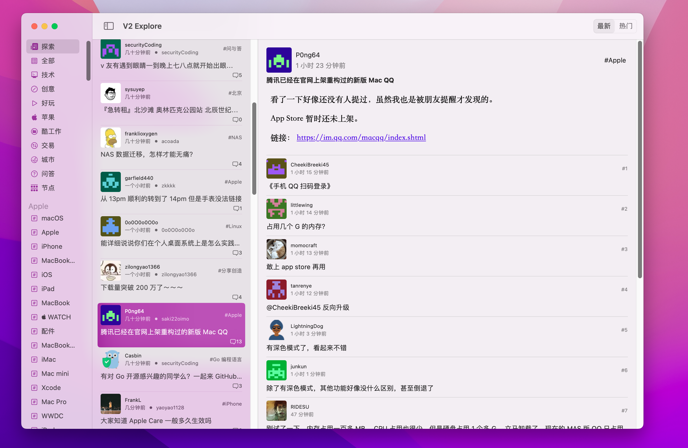

# V2 Explore

## 介绍

V2 Explore 是一个基于 SwiftUI 开发的跨多个苹果平台的第三方 [V2EX](https://v2ex.com) 客户端，支持 iOS、iPadOS 和 macOS。本开源项目是作者学习 Swift 和 SwiftUI 的实践项目，同时也供有兴趣的开发者学习与交流。

## 下载链接

[TestFlight](https://testflight.apple.com/join/SdCh3Wbb)

## 截图

### iOS

### iPadOS

### macOS

## 第三方库

- [Kingfisher](https://github.com/onevcat/Kingfisher)
- [SwiftSoup](https://github.com/scinfu/SwiftSoup)

## 许可证

[Apache 许可证](./LICENSE).

---

Copyright © 2022 Mak Ho Cheung. All Rights Reserved.
